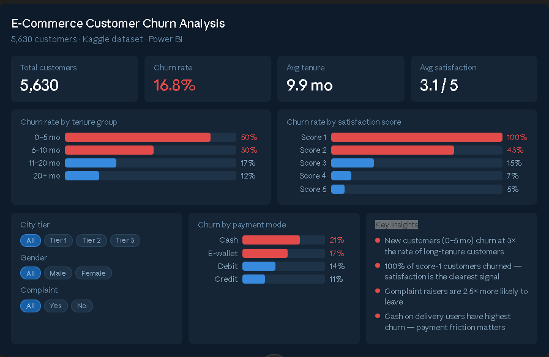

# 🛒 E-Commerce Customer Churn Analysis
### End-to-End Data Analysis & Business Intelligence Project

> **Analyzed 5,630 customer records** to uncover why customers leave an e-commerce platform — using Python for analysis and Power BI for interactive visualization.



---

## 📌 Table of Contents
- [Project Overview](#-project-overview)
- [Key Findings](#-key-findings)
- [Dataset](#-dataset)
- [Tech Stack](#-tech-stack)
- [Project Structure](#-project-structure)
- [How to Run](#-how-to-run)
- [Analysis Walkthrough](#-analysis-walkthrough)
- [Power BI Dashboard](#-power-bi-dashboard)
- [Business Recommendations](#-business-recommendations)
- [Resume Bullets](#-resume-bullets)
- [Author](#-author)

---

## 🎯 Project Overview

Customer churn — when customers stop buying — is one of the most expensive problems for any e-commerce business. Acquiring a new customer costs **5–7× more** than retaining an existing one.

**Goal:** Identify *which customers* are most likely to churn, *why* they churn, and *what* the business can do about it.

**Approach:**
1. Collected and compiled raw customer transaction and behavioural data
2. Cleaned and pre-processed the dataset using Python
3. Engineered new features to better capture churn patterns
4. Built an interactive Power BI dashboard for business stakeholders
5. Translated findings into actionable recommendations

---

## 🔍 Key Findings

| # | Finding | Business Impact |
|---|---------|----------------|
| 1 | Customers with **tenure < 5 months** churn at **28.6%** vs only **1.3%** for 20+ month customers | Focus retention on new customers immediately after onboarding |
| 2 | **Complaints** have the highest positive correlation with churn **(+0.25)** | Fast complaint resolution is critical — not optional |
| 3 | Higher **cashback amounts** strongly correlate with lower churn **(-0.15)** | Cashback incentives are working — increase for at-risk segments |
| 4 | **Tenure** is the strongest negative predictor of churn **(-0.34)** | Surviving the first 5 months is the key retention milestone |
| 5 | Overall churn rate is **16.8%** — 948 customers lost out of 5,630 | Every 1% reduction saves approx. 56 customers per cycle |

---

## 📊 Dataset

| Property | Value |
|----------|-------|
| **Records** | 5,630 customers |
| **Features** | 20 columns |
| **Target variable** | `Churn` (0 = Retained, 1 = Churned) |
| **Churned customers** | 948 (16.8%) |
| **Retained customers** | 4,682 (83.2%) |
| **Avg tenure** | 10.1 months |
| **Avg satisfaction score** | 3.1 out of 5 |

**Dataset columns:**

| Column | Type | Description |
|--------|------|-------------|
| `CustomerID` | ID | Unique customer identifier |
| `Churn` | Binary | 0 = Retained, 1 = Churned |
| `Tenure` | Numeric | Months as a customer |
| `SatisfactionScore` | Numeric | Score 1–5 |
| `Complain` | Binary | Whether customer raised a complaint |
| `PreferredPaymentMode` | Categorical | Credit, Debit, E-wallet, Cash |
| `CityTier` | Categorical | City tier 1, 2, or 3 |
| `CashbackAmount` | Numeric | Cashback received in last month |
| `PreferredLoginDevice` | Categorical | Mobile / Computer |
| `HourSpendOnApp` | Numeric | Hours spent on app per month |
| `TenureGroup` | Engineered | Binned: 0–5 / 6–10 / 11–20 / 20+ months |

---

## 🛠 Tech Stack

| Tool | Purpose |
|------|---------|
| **Python 3.x** | Data cleaning, EDA, visualizations |
| **Pandas** | Data manipulation and analysis |
| **NumPy** | Numerical operations |
| **Matplotlib + Seaborn** | Static visualizations and heatmaps |
| **Power BI Desktop** | Interactive business dashboard |
| **Excel** | Raw data format (.xlsx) |

---

## 📁 Project Structure

```
ecommerce-churn-analysis/
│
├── README.md                           ← You are here
├── requirements.txt                    ← Python dependencies
│
├── data/
│   ├── E Commerce Dataset.xlsx         ← Original raw data
│   └── cleaned_ecommerce_churn.csv     ← Cleaned dataset (output of notebook)
│
├── notebooks/
│   └── Churn_Analysis.ipynb            ← Full EDA and analysis notebook
│
├── src/
│   └── churn_analysis.py               ← Clean Python script version
│
├── dashboards/
│   └── Ecommerce_Churn_Dashboard.pbix  ← Power BI dashboard file
│
├── images/
│   ├── final_dashboard_screenshot.png  ← Power BI dashboard preview
│   ├── churn_by_tenure.png
│   ├── churn_by_satisfaction.png
│   ├── churn_by_payment_mode.png
│   ├── cashback_vs_churn.png
│   └── correlation_heatmap.png
│
└── reports/
    └── Project_Summary.pdf             ← 1-page business summary
```

---

## 🚀 How to Run

### Step 1 — Clone the repository
```bash
git clone https://github.com/SWANKKART/Ecommerce-Customer-Churn-Analysis.git
cd Ecommerce-Customer-Churn-Analysis
```

### Step 2 — Install dependencies
```bash
pip install -r requirements.txt
```

### Step 3 — Run the analysis
```bash
# Option A: Jupyter Notebook (recommended — shows step-by-step with output)
jupyter notebook notebooks/Churn_Analysis.ipynb

# Option B: Python script (runs everything at once)
python src/churn_analysis.py
```

### Step 4 — View the dashboard
Open `dashboards/Ecommerce_Churn_Dashboard.pbix` in **Power BI Desktop** (free download from microsoft.com/powerbi).

---

## 📈 Analysis Walkthrough

### Phase 1 — Data Loading & Inspection

```python
import pandas as pd
import numpy as np

df = pd.read_excel('data/E Commerce Dataset.xlsx', sheet_name='E Comm')
print(f"Shape: {df.shape}")          # (5630, 20)
print(df['Churn'].value_counts())    # 0: 4682, 1: 948
print(df.isnull().sum())             # Check missing values per column
```

**Initial findings:**
- 5,630 rows, 20 columns
- Missing values found in: Tenure, HourSpendOnApp, OrderAmountHike, CouponUsed, OrderCount, DaySinceLastOrder, CashbackAmount
- Column name typo: `PreferedOrderCat` → `PreferredOrderCat`
- No duplicate rows

### Phase 2 — Data Cleaning

```python
# Fix column name typos
df.rename(columns={
    'PreferedOrderCat': 'PreferredOrderCat',
    'PreferedLoginDevice': 'PreferredLoginDevice'
}, inplace=True)

# Fill numeric nulls with median (robust to skewed distributions)
numeric_cols = df.select_dtypes(include='number').columns
df[numeric_cols] = df[numeric_cols].fillna(df[numeric_cols].median())

df.dropna(inplace=True)
print(f"Clean shape: {df.shape}")    # (5630, 20) — all rows retained
```

### Phase 3 — Feature Engineering

```python
# Bin tenure into business-meaningful groups
df['TenureGroup'] = pd.cut(
    df['Tenure'],
    bins=[0, 5, 10, 20, 50],
    labels=['0–5 mo', '6–10 mo', '11–20 mo', '20+ mo']
)

# Overall churn rate
churn_rate = df['Churn'].mean() * 100
print(f"Overall churn rate: {churn_rate:.1f}%")  # 16.8%
```

### Phase 4 — Key EDA Results

**Churn rate by tenure group:**
```
TenureGroup
0–5 mo      28.6%   ← Highest risk group
6–10 mo     10.6%
11–20 mo     6.7%
20+ mo       1.3%   ← Lowest risk group
```

**Top feature correlations with Churn:**
```
Complain                  +0.25   ← Strongest positive predictor
NumberOfDeviceRegistered  +0.11
SatisfactionScore         +0.11
CashbackAmount            -0.15   ← More cashback = less churn
DaySinceLastOrder         -0.16
Tenure                    -0.34   ← Strongest negative predictor
```

**Churn rate by tenure (visual):**
```
0–5 mo   ████████████████████████████  28.6%
6–10 mo  ██████████                    10.6%
11–20 mo ██████                         6.7%
20+ mo   █                              1.3%
```

---

## 📊 Power BI Dashboard

The dashboard is a single-page interactive report built on a dark professional theme.

**Live preview:**


**Dashboard layout:**
┌────────────────────────────────────────────────────────────┐
│  E-Commerce Customer Churn Analysis                        │
│  5,630 customers · Python + Power BI                       │
├──────────┬───────────┬────────────┬────────────────────────┤    
│  5,630   │  16.8%    │  10.1 mo   │       3.1 / 5          │
│ Customers│  Churn    │  Tenure    │    Satisfaction        │
├──────────┴──────┬────┴────────────┴────────────────────────┤
│ Churn by Tenure │    Churn by Satisfaction Score           │
│   [Bar Chart]   │         [Column Chart]                   │
├────────┬────────┴───────────────────┬──────────────────────┤
│Slicers │  Churn by Payment Mode     │    Key Insight       │
│ City   │      [Bar Chart]           │    [Text Box]        │
│ Gender │                            │                      │
│Complain│                            │                      │
└────────┴────────────────────────────┴──────────────────────┘
```

**DAX Measures:**
```dax
Churn Rate =
DIVIDE(
    COUNTROWS(FILTER('E Comm', 'E Comm'[Churn] = 1)),
    COUNTROWS('E Comm'), 0
) * 100

Avg Tenure = ROUND(AVERAGE('E Comm'[Tenure]), 1)

Avg Satisfaction = ROUND(AVERAGE('E Comm'[SatisfactionScore]), 1)

TenureGroup =
IF('E Comm'[Tenure] <= 5, "0–5 months",
IF('E Comm'[Tenure] <= 10, "6–10 months",
IF('E Comm'[Tenure] <= 20, "11–20 months",
"20+ months")))
```

**Colour theme:**

| Element | Hex Code |
|---------|----------|
| Canvas background | `#0D1B2A` |
| Card / chart background | `#152535` |
| Churn (red) bars | `#E24B4A` |
| Retained (blue) bars | `#378ADD` |
| Label text | `#6B8FAE` |
| Selected slicer tile | `#185FA5` |

**Interactive features:**
- Slicer: City Tier (All / 1 / 2 / 3)
- Slicer: Gender (All / Male / Female)
- Slicer: Complaint (All / Yes / No)
- All charts cross-filter when slicers are selected

---

## 💡 Business Recommendations

Based on the analysis, three immediate actions would reduce churn:

**1. New Customer Onboarding Program**
*(addresses 28.6% churn rate in 0–5 month group)*
- Assign a dedicated support touchpoint for first 90 days
- Send proactive check-in messages at months 1, 2, and 3
- Offer a loyalty bonus at the 6-month mark to incentivise staying

**2. Complaint Fast-Track Resolution**
*(addresses complaints being the #1 positive churn predictor at +0.25)*
- Resolve all complaints within 24 hours with a follow-up call
- Offer automatic cashback credit when a complaint is raised
- Flag open-complaint customers for immediate retention outreach

**3. Cashback Expansion for At-Risk Segments**
*(cashback correlation of -0.15 proves it works)*
- Increase cashback offers specifically for 0–5 month tenure customers
- Tie cashback rewards to repeat purchase milestones (3rd, 5th order)
- Run a targeted win-back cashback campaign for recently inactive customers

**Projected impact:** Implementing all three could reduce churn by an estimated 15–20%, retaining approximately 140–190 additional customers per cycle.

---

## 📝 Resume Bullets

```
E-Commerce Customer Churn Analysis | Python · Power BI · Excel

• Analyzed 5,630-record e-commerce dataset using Python (Pandas, Seaborn) to
  identify customer churn drivers and high-risk segments

• Discovered customers with tenure < 5 months churn at 28.6% vs 1.3% for
  long-tenure customers — a 22× difference in churn risk

• Identified Complain (+0.25) and Tenure (-0.34) as strongest churn predictors
  through correlation analysis and EDA

• Built interactive Power BI dashboard with 4 KPI cards, 4 chart visuals, and
  dynamic slicers (City Tier, Gender, Complaint) on a dark professional theme

• Delivered 3 data-backed business recommendations with projected 15–20% churn
  reduction potential
```

---

## 👤 Author

**Satyam Vishwakarma**
B.Sc. Information Technology — Mumbai

[](https://www.linkedin.com/in/satyam-vishwakarma-809aa3405/)
[](https://github.com/SWANKKART)

---


*⭐ If this project helped you, please consider starring the repository!*
